<p align="center">
  
  
  
  
  
  
  
</p>

# 基于 Spring 生态全家桶的下一代分布式电商平台与全域 Agent 自演化闭环系统的设计与实现

| 项目信息 | |
|---|---|
| **性质** | 本科毕业设计 · 北华大学 计算机科学技术学院 软件工程（2023–2027） |
| **作者 / 学号** | 朱道阳 / 202315050327 ｜ 邮箱：[1732446549@qq.com](mailto:1732446549@qq.com) |
| **GitHub** | [Dddddduo](https://github.com/Dddddduo) ｜ 本仓库：[spring-distributed-ecommerce-global-agent](https://github.com/Dddddduo/spring-distributed-ecommerce-global-agent) |

## 目录

- [一、一图看懂本仓库](#一图看懂本仓库)
- [二、绪论：AI 元年、现时代局限与下一代前瞻](#二绪论ai-元年现时代局限与下一代前瞻)
- [三、为什么做这个课题](#三为什么做这个课题)
- [四、总体架构：三域闭环与数据暗线](#四总体架构三域闭环与数据暗线)
- [五、第一部分 · 分布式电商平台（执行底座）](#五第一部分--分布式电商平台执行底座-ecommerce)
- [六、第二部分 · Spring AI 全域 Agent 系统（认知中枢）](#六第二部分--spring-ai-全域-agent-系统认知中枢-agent)
- [七、第三部分 · AI 自动化闭环测试框架（自演化引擎）](#七第三部分--ai-自动化闭环测试框架自演化引擎-testing)
- [八、全链路闭环演示：一次超卖缺陷的自发现-自修复之旅](#八全链路闭环演示一次超卖缺陷的自发现-自修复之旅)
- [九、代码仓库结构](#九代码仓库结构)
- [十、快速开始](#十快速开始)
- [十一、创新性论证（答辩口径）](#十一创新性论证答辩口径)
- [十二、Roadmap](#十二roadmap)
- [十三、参考文献](#十三参考文献)

---

## 一图看懂本仓库

本仓库是由**三个平级工程文件夹**构成的 Monorepo，分别对应毕业设计的三个部分。三者不是并列的三个系统，而是一个闭环：

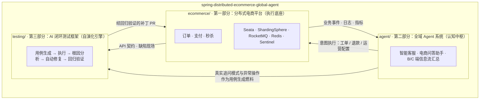

> **一句话总结**：电商产生数据，Agent 理解并行动，数据暴露缺陷，测试框架自动修复——修好的系统承接更大流量，流量喂养更聪明的 Agent。**闭环本身，才是本课题的第一发明物。**

---

## 二、绪论：AI 元年、现时代局限与下一代前瞻

2022 年 11 月 ChatGPT 发布，被视为继图灵 1950 年之问[[24]](#十三参考文献)之后的 **"AI 元年"**：大模型第一次同时具备可工程化的**推理**（CoT[[16]](#十三参考文献)）、**行动**（Function Calling / ToolLLM[[18]](#十三参考文献)）与**自反思**（Reflexion[[12]](#十三参考文献)、Self-Refine[[13]](#十三参考文献)）能力。这组合催生软件工程史上第一次出现的可能：**让系统自己发现缺陷、定位根因、修复代码、验证回归**。

然而现时代存在三大局限：

| 局限 | 现状 | 病根 |
|---|---|---|
| **系统孤岛** | 分布式电商解决"高并发下如何正确"，智能体解决"开放语义下如何理解"，二者烟囱式分立 | 数据与行动在两域之间不存在通路 |
| **质量人力瓶颈** | 缺陷靠人发现、用例靠人编写、补丁靠人提交、回归靠人执行 | 人是流水线中唯一不可水平扩展的节点 |
| **语义与事务割裂** | 业务接口靠文档、靠人肉对齐，一次变更上下游震荡 | 确定性事务与概率性语义缺少统一契约层 |

| 时代坐标 | 主流做法 | 本课题的下一代范式 |
|---|---|---|
| 工业 2.0（2010s–2020s） | 微服务电商 + 关键词客服 | 三域事件级打通，一张统一信息流 |
| 过渡期（2023–2025） | Copilot 辅助编码、单点客服 Bot、LLM 生成单测 | Agent 全链路接管"发现→定位→修复→验证" |
| 本课题前瞻（2026–） | —— | **自演化闭环**：缺陷即养料、日志即语料、流量即训练 |
| 远期展望（2030s） | —— | 跨系统闭环互认，缺陷知识资产可迁移 |

**课题目标**：在同一个 Spring 生态代码库内，构建"分布式电商 × 全域 Agent × 自动测试修复"三域闭环原型，并给出可度量的工程证据。本课题不主张"AI 取代工程师"，而主张工程师角色从"系统的操作者"上移为"**闭环的立法者**"——定义不变式、设定门禁、仲裁例外。

---

## 三、为什么做这个课题

作者的三段实习与一段校内项目，恰好逐一对应本课题的三个部分：第一段实习（企业级 ERP 后端，SQL 调优与慢查询治理）让人看到**质量瓶颈沉淀在工程师的个人经验里**；第二段实习（电商 ERP 中台后端，订单/物流/退款模块与大促风险排查）让人看到**分布式的危险藏在洪峰、竞态与异构叠加态里**；第三段实习（快手电商技术部支付质量中心 AI 测试开发，负责人从 0 到 1 建设支付测试 AI 交付平台，白盒测试提效 70%）则以工业事实证明 **Agent 驱动的测试闭环在金融级支付场景成立**；校内省级实验室项目（SpringCloud Alibaba + Seata + ShardingJDBC + RocketMQ 的二手交易电商平台）则已经备好执行底座的雏形。

> **一句话动机**：三段实习和一个电商项目共同指向同一个未完成的命题——让系统拥有不依赖人的、自我发现并自我修复的能力；本课题即把"测试域的单点闭环"扩展为"电商 × Agent × 测试"的三域自演化闭环，在一个人可全栈把握的尺度上重铸这一能力。

| 毕设位置 | 经验来源 | 迁移 / 升级 |
|---|---|---|
| 五 · 分布式锁"一锁二判三更新" | 校内项目自研 Redisson 锁注解 | 泛化为秒杀去重 + 支付幂等通用组件 |
| 五 · 分库分表 / 基因法 ID | 校内项目多 Key 分片 + ShardingJDBC | 升级 ShardingSphere 全链路 + 影子库压测 |
| 五 · 秒杀削峰与背压 | ERP 抓单洪峰阻塞、大促序列化 OOM 等事故排查 | 教训反推设计：Sentinel + Lua 预扣 + MQ 异步 |
| 五 · 支付状态机与幂等矩阵 | 支付渠道质量实践（国补 / 通道改造 / 存管行） | 真实渠道异常样本 → 状态机边界条件 |
| 六 · 客服护栏与转人工 | 支付工单流程认知 + 商家侧支持场景 | Agent 承认能力边界，超阈值转人工 |
| 七 · 测试五环流水线与 Skill 组件化 | 支付测试 AI 交付平台（提效 70%，2h→50min） | 工业方案开源重铸 |
| 七 · 多实例互斥 / TTL 续期 / 心跳重连 | 同平台多实例部署工程问题（可用率 90%） | 同一方案体系在毕设尺度复现 |

---

## 四、总体架构：三域闭环与数据暗线

### 4.1 分层拓扑

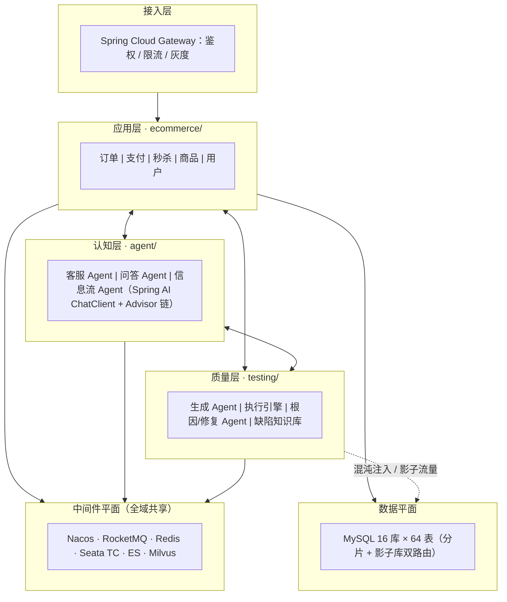

### 4.2 三条数据暗线

| 暗线 | 方向 | 载体 | 内容 | 断线后果 |
|---|---|---|---|---|
| **信息流** | 电商 → Agent | RocketMQ 事件总线 + ES/Milvus | 订单状态、库存告警、对话日志、行为埋点 | Agent 退化为"会说话的搜索框" |
| **行动流** | Agent → 电商 | MCP Tool / 内部 API | 退款工单、券发放、商家预警、活动配置 | Agent 退化为"只会聊天的摆设" |
| **演化流** | 电商 ⇄ 测试 ⇄ Agent | CI 事件 + Git PR + 缺陷知识库 | API 契约、失败栈、根因结论、补丁 PR | 系统退回人工质量时代 |

其中**演化流为本课题独有**：现时代不存在公开系统把"线上缺陷现场"自动转化为"测试资产与代码补丁"并在同一代码库内闭环。

### 4.3 统一契约层：闭环的"通用语"

三域之所以能对话，是因为存在单一事实来源的契约层（OpenAPI 3.x 同步契约 + AsyncAPI 事件契约 + MCP Tool 定义）。电商代码经 springdoc 自动导出契约，同一契约既驱动 Agent 工具面，又驱动测试用例生成；接口一旦变更，CI 触发**契约差分**，三域在同一次流水线内联动更新——这是"语义即接口"的工程落点。

### 4.4 降级策略：三环可独立运行

自演化是"锦上添花"的性质，不是"生死依赖"：Agent 域失联 → 客服入口降级为工单表单，电商照常交易；测试域失联 → CI 回退传统 JUnit 门禁，存量用例仍全量执行；电商域局部故障 → Agent 回答标注"数据可能延迟"并禁用资金类工具。恢复后以 MQ 事件补偿回放追平。**只有三环同时在线，系统才具备自演化性质。**

### 4.5 非功能性指标

| 指标 | 目标 | 度量方式 |
|---|---|---|
| 秒杀入口峰值 | 10 万 QPS（压测口径） | JMeter + 影子库全链路压测 |
| 下单链路 P99 | < 200ms | Micrometer + Prometheus |
| 库存终态一致性 | 超卖率 = 0，少卖可对账归零 | 每小时对账 + 并发风暴探针 |
| 客服首 token 延迟 | < 1.5s | Spring AI 观测埋点 |
| 缺陷自修复率 | 合成缺陷 ≥ 60% | 质量看板（覆盖率 + 变异分数） |

---

## 五、第一部分 · 分布式电商平台（执行底座 · `ecommerce/`）

### 5.1 技术选型论证

| 位置 | 选型 | 为什么 | 为什么不用替代方案 |
|---|---|---|---|
| 微服务 | Spring Cloud Alibaba（Nacos+OpenFeign+Sentinel） | 注册/配置/流控一体化，与 Boot 3 无缝 | Dubbo3 治理需自建；gRPC 与契约层摩擦大 |
| 分库分表 | ShardingSphere-JDBC[[19]](#十三参考文献) | 进程内代理零网络跳，解析/路由/归并全托管 | Proxy 模式多一跳 RT；自研路由难覆盖跨片归并 |
| 分布式事务 | Seata AT 为主 + TCC/Saga 按场景[[20]](#十三参考文献) | AT 无侵入，undo_log 前后镜像自动补偿 | 2PC/XA 长期持锁吞吐差；手写补偿不可维护 |
| 缓存与锁 | Redis Cluster + Redisson[[21]](#十三参考文献) | Lua 原子性 + 可重入锁 + 看门狗 | 裸 SETNX 有三大缺陷（见 5.4） |
| 消息 | RocketMQ 5.x[[22]](#十三参考文献) | 事务消息/延时消息/顺序消息原生齐备 | Kafka 无原生事务消息与任意级延时 |
| 限流熔断 | Sentinel[[25]](#十三参考文献) | 热点参数限流正中秒杀 | Hystrix 停维；Resilience4j 缺热点维度 |

### 5.2 秒杀模块：两套方案对一个不变式

**不变式**：`不超卖 · 不少卖 · 一人一单`。设计遵循 CAP[[1]](#十三参考文献)：入口在分区容忍下选 **AP**（先扛住流量），落库与终态选 **CP**（对账保证不多不少）。

**方案 A（默认）：Redis+Lua 预扣 → 事务消息 → 限速落库**

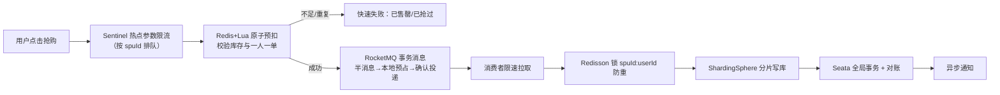

```lua
-- seckill.lua：KEYS[1]=库存 KEYS[2]=已购SET ARGV[1]=userId ARGV[2]=num
if redis.call('SISMEMBER', KEYS[2], ARGV[1]) == 1 then return -2 end        -- 一人一单
if tonumber(redis.call('GET', KEYS[1]) or '0') < tonumber(ARGV[2]) then return -1 end -- 售罄
redis.call('DECRBY', KEYS[1], ARGV[2]); redis.call('SADD', KEYS[2], ARGV[1]); return 1
```

选事务消息而非直接下单：Redis 扣减与 DB 落库分属两个资源，两军问题[[4]](#十三参考文献)决定不存在单机跨资源事务；"半消息 + 本地表回查"把两步收敛为最终一致，回查兜底生产者崩溃。

**方案 B（热点库存行）：InventoryHint 分桶原子扣减**——库存拆 16 个桶行，按 userId 一致性哈希路由，`UPDATE ... SET stock=stock-1 WHERE bucket=? AND stock>0` 单语句原子扣减，失败随机重选桶 ≤3 次，每 5s 桶间再平衡；行锁竞争被摊薄 16 倍。两方案经 Nacos 开关一键切换，并由第三部分并发风暴探针在影子库验证两方案对同一竞态时序**输出不变式一致**。

### 5.3 分库分表与基因法全局 ID

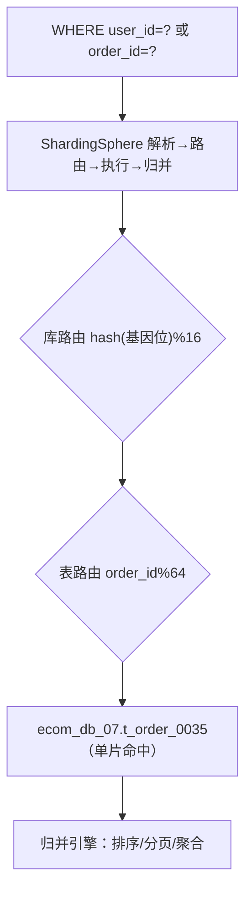

**基因法主键**：雪花 ID 低 10bit 替换为 `user_id` 低 10bit——仅凭订单号（支付回调、对账、客服工单）即可反解分库分表位，规避全库广播。容量：16 库 × 64 表 ≈ 20 亿订单；扩容走**成倍迁移**（双写 → Canal 追平历史 → 影子逐行对比 → 读流量灰度切换）。读写分离下所有非事务读走从库；**压测流量经同一路由引擎落影子库**（`shadow_` 前缀），与生产同构演练——这正是第三部分 AI 测试的隔离演练场。

### 5.4 分布式锁：一锁、二判、三更新

裸 `SETNX` 三大经典缺陷[[8]](#十三参考文献)与 Redisson 化解：

| 缺陷 | 后果 | Redisson 化解 |
|---|---|---|
| 解锁误删他人锁 | A 超时后 B 持锁，A 的 DEL 删掉 B 的锁 | Hash 记录 `uuid:重入数`，解锁 Lua 校验持有者 |
| 过期时间两难 | 短→业务未完锁先失效；长→故障锁死 | **看门狗**每 10s 续期，宕机 30s 自动释放 |
| 不可重入 | 同线程嵌套自死锁 | field 计数，加/解锁对称增减 |

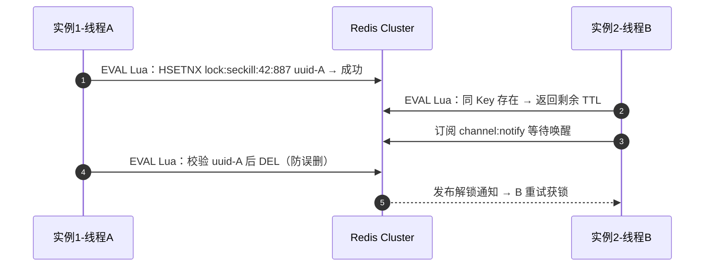

业务层固化"**一锁二判三更新**"注解范式（源自校内项目，本课题泛化）：

```java
@DistLock(key = "'seckill:' + #spuId + ':' + #userId", waitTime = 300, leaseTime = -1)
public SeckillResult doSeckill(Long spuId, Long userId, Integer num) {
    // 一锁：注解按 SpEL 粒度加锁；二判：锁内二次校验防竞态
    if (orderService.existsByUserSpu(userId, spuId)) return SeckillResult.duplicated();
    return orderService.createSeckillOrder(spuId, userId, num); // 三更新：幂等落库
}
```

### 5.5 分布式事务：按场景选模式

| 场景 | 模式 | 理由 |
|---|---|---|
| 跨服务下单（订单+库存+券） | **Seata AT** | 无侵入，undo_log 自动补偿[[20]](#十三参考文献) |
| 支付退款、资金冻结 | **TCC** | Try 冻结 / Confirm 扣划 / Cancel 解冻，资源可预留 |
| 售后多日协商 | **Saga 编排** | 长事务，服务链正向、补偿链逆向[[6]](#十三参考文献) |
| 秒杀 MQ 落单 | **事务消息** | 异步优先，最终一致可接受 |

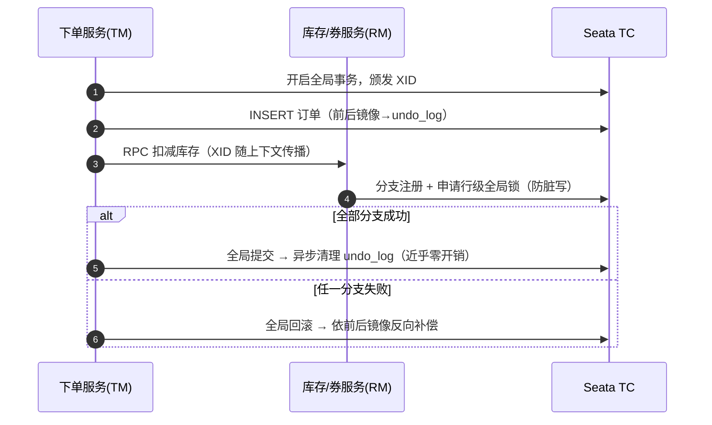

**对账中心**是所有最终一致路径的最后防线：每小时扫描"订单—支付—库存流水"三元组差异，进补偿队列，失败 3 次转人工工单——工单同时进入第二部分客服 Agent 待办池，成为闭环联动点。

### 5.6 订单与支付模块

**订单责任链**（源自校内项目，扩展为可配置链）：参数完整 → 用户风控 → 商品在售 → 券可用 → 库存限购 → 地址可达，任一失败短路返回结构化错误码（**错误码自动回流测试框架生成负向用例**）。

**订单状态机**：`CREATED → PAYING → PAID → SHIPPED → COMPLETED →（AFTER_SALE → REFUNDING → REFUNDED）`，超时走 `CLOSED`。跃迁 SQL 以**状态机 + 乐观锁**双保险，化解"支付回调 vs 超时关单"并发冲突[[5]](#十三参考文献)：

```sql
UPDATE t_order SET status='PAID', version=version+1
WHERE order_id=? AND status='PAYING' AND version=?;
-- 影响行数=0 → 跃迁已被并发完成 → 幂等返回成功，绝不盲目重试
```

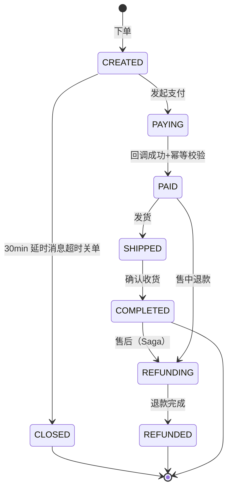

**支付幂等矩阵**——回调天然是"至少一次 + 可能乱序 + 可能重复"[[5]](#十三参考文献)：

| 回调到达时订单态 | 处置 | 依据 |
|---|---|---|
| PAYING | 正常跃迁 PAID，事务消息通知下游 | 首次成功 |
| PAID 及之后 | 幂等确认直接 ACK | 重复回调 |
| CLOSED（已关单） | 触发自动退款（Saga 逆向链） | 钱已收、单已关的竞态兜底 |
| CREATED | 拒绝并要求渠道重推 | 状态机非法，疑越序 |

验签（渠道公钥+时间戳+随机串）后以 `pay_no` 唯一索引插入流水实现幂等；每 5min 主动反查"处理中"支付单，防回调彻底丢失；支付成功后"事务钩子 + 定时任务"双通道推送弱依赖域（积分/存证），共用同一幂等键。

---

## 六、第二部分 · Spring AI 全域 Agent 系统（认知中枢 · `agent/`）

### 6.1 技术骨架

以 Spring AI 1.0[[14]](#十三参考文献) 的 `ChatClient` 为统一入口，**Advisor 责任链**（记忆 → RAG → 安全护栏）编排 Agent；模型可插拔（OpenAI / 通义 / DeepSeek / Ollama）；工具即第一部分的真实业务 API（`@Tool` 暴露订单查询、退款申请等，经 MCP 协议统一描述）；向量检索经 Embedding 写入 Milvus/PGVector。设计依据：ReAct 推理-行动交替[[9]](#十三参考文献)、RAG 知识接地[[10]](#十三参考文献)、Self-Refine 自我批评兜底[[13]](#十三参考文献)。

### 6.2 智能客服：ReAct 环 + RAG + Function Calling

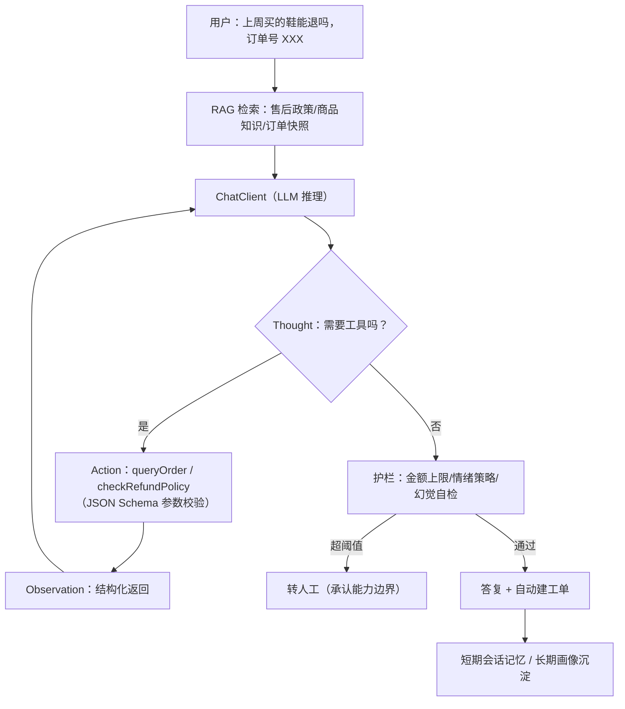

每步外部观测都收敛下一轮思考，从根上压制幻觉；资金类工具设硬限额，超限强制转人工。

### 6.3 电商智能问答助手（C 端导购）

`Question → 意图识别 → 商品/优惠/物流多源检索 → 对比推荐` 替代关键词搜索；意图分类由 Spring AI 结构化输出（`BeanOutputConverter`）直接产出 Java 对象，与电商 DTO 严丝合缝——"语义即接口"在用户侧的落地形态。

### 6.4 B/C 端信息流汇总：Agent 的全知上下文层

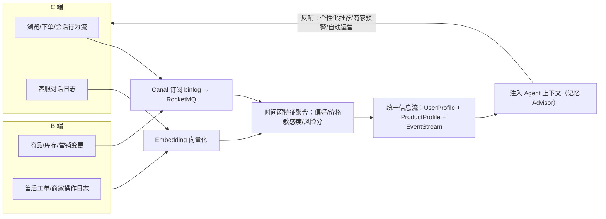

**信息流同时是第三部分的核心数据源**：真实用户的追问模式、商家的异常操作被测试框架采样为用例生成燃料——三域闭环中最关键的暗线。

### 6.5 Agent 评测体系

没有度量就没有工程：以固定问答金集测准确率、以任务完成率测工具链（多跳调用成功率）、以护栏拦截率测对抗安全（红队语料：Prompt 注入、越权退款诱导）、以幻觉率与拒答合理率测接地质量。评测结果写入质量看板，同时作为测试框架的"Agent 域回归基线"。

---

## 七、第三部分 · AI 自动化闭环测试框架（自演化引擎 · `testing/`）

> 学术锚点：LLM 测试生成（Lemieux et al., ICSE 2023[[26]](#十三参考文献)；Meta 工业实践 FSE 2024[[27]](#十三参考文献)）与自动程序修复（AlphaRepair, ICSE 2023[[28]](#十三参考文献)）；工程锚点：作者在快手支付质量中心从 0 到 1 的测试 AI 交付平台实践（Skill 组件化流水线、Harness 方法论、白盒提效 70%、任务 2h→50min）。

### 7.1 五环流水线

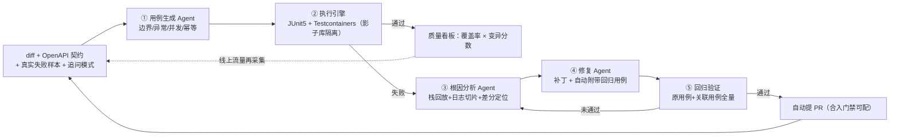

### 7.2 与 CI/CD 的时序集成

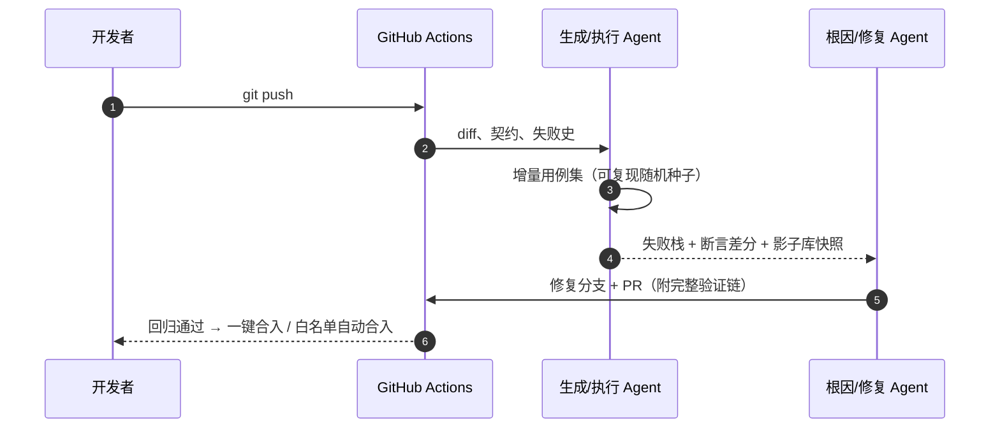

### 7.3 分布式专属探针：触碰传统测试的盲区

| 探针 | 验证目标 | 手段 |
|---|---|---|
| **混沌注入** | Seata 回滚、MQ 重投、Redis 主从切换 | Testcontainers 杀容器，Agent 判定业务终态一致性 |
| **并发风暴** | 秒杀超卖 / 支付幂等 | 生成 N×M 竞态时序用例，校验"一单不多、一单不少"不变式；方案 A/B 等价性验证 |
| **对抗语料** | 客服越权退款、Prompt 注入 | 红队 Agent 攻击蓝队 Agent，拦截率入看板 |

### 7.4 多实例部署的服务端工程难题（工业方案复现）

流式 Agent 长任务在多实例下会遭遇连接漂移与重复执行，本框架复现同一套解法：**两层互斥**（Redis Pub/Sub 广播任务归属 + Reactor `dispose()` 释放旧连接）；**租约续期**（5min TTL 续期 + 实例归属校验，长任务 30min+ 零过期）；**断线自愈**（心跳 + CAS 重连 + 全链路引用刷新）。可用率目标 ≥ 90%（对齐工业实测口径）。

### 7.5 自演化机制：飞轮

借鉴 Voyager 技能库累积[[11]](#十三参考文献)与 Reflexion 语言化强化[[12]](#十三参考文献)：每次根因分析结论写入向量化的**缺陷知识库**，同类代码变更生成用例时优先召回——框架"见过越多、越聪明"：

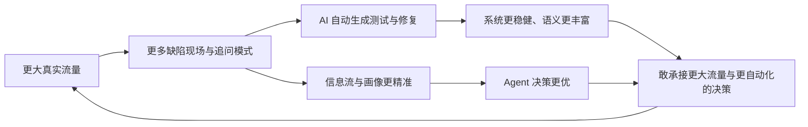

---

## 八、全链路闭环演示：一次超卖缺陷的"自发现-自修复"之旅

假设第一部分某次重构引入竞态：并发风暴探针在影子库复现"同用户双端并发抢购，出现 1 单超卖"。三域在无人值守下的接力：

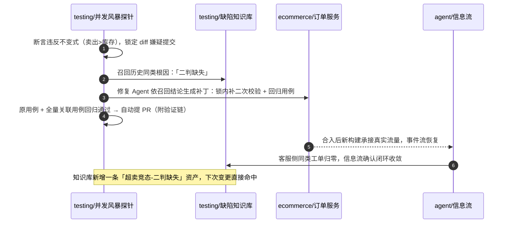

**这就是"自演化"的准确含义：缺陷不再是损失，而是系统的一次学习。**

---

## 九、代码仓库结构

三个工程文件夹与 README **同级**，各自独立可构建；公共契约与部署编排置于 `deploy/`、`docs/`：

```text
spring-distributed-ecommerce-global-agent/
├── README.md                  # 本文件 · 课题总纲
├── ecommerce/                 # 第一部分：分布式电商平台
│   ├── ecom-gateway/          #   Spring Cloud Gateway + Sentinel 规则
│   ├── ecom-order/            #   订单：责任链校验 / 状态机 / 延时关单
│   ├── ecom-payment/          #   支付：幂等矩阵 / 回调验签 / 反查对账
│   ├── ecom-seckill/          #   秒杀：Lua 预扣(A) / InventoryHint(B) / MQ 削峰
│   ├── ecom-item/             #   商品 + ES 同步（Canal）
│   └── ecom-common/           #   雪花基因法 / 锁注解 / 对账 SDK
├── agent/                     # 第二部分：Spring AI 全域 Agent
│   ├── agent-customer/        #   智能客服 + 电商问答助手（ChatClient + Advisor）
│   ├── agent-flow/            #   B/C 端信息流汇总（事件聚合 + 画像）
│   ├── agent-memory/          #   长短期记忆 + 向量检索（Milvus/PGVector）
│   └── agent-tools/           #   MCP 工具面：封装 ecommerce 真实 API
├── testing/                   # 第三部分：AI 闭环测试框架
│   ├── test-gen-agent/        #   用例生成（契约差分 / 负向 / 并发时序）
│   ├── test-runner/           #   执行引擎 + 混沌注入 + 影子库隔离
│   ├── test-repair-agent/     #   根因分析 / 补丁生成 / 回归验证
│   └── test-knowledge/        #   缺陷知识库（向量化技能库）
├── deploy/
│   ├── docker-compose.yml     #   MySQL/Redis/RocketMQ/Nacos/Seata/Milvus
│   └── k8s/                   #   多实例 Agent 部署（互斥/心跳配置样例）
└── docs/
    ├── contract/              #   OpenAPI / AsyncAPI / MCP 单一事实来源
    └── reports/               #   压测报告 / 质量看板快照 / 论文图表源
```

---

## 十、快速开始

```bash
git clone https://github.com/Dddddduo/spring-distributed-ecommerce-global-agent
cd spring-distributed-ecommerce-global-agent
docker compose -f deploy/docker-compose.yml up -d     # 中间件全家桶
mvn -B clean package -DskipTests
java -jar ecommerce/ecom-seckill/target/*.jar         # 第一部分：秒杀链路
# 第二部分：配置模型密钥后启动 agent/agent-customer
export OPENAI_API_KEY=***        # 或 OLLAMA_MODEL=qwen3:14b 本地推理
# 第三部分：CI 内由 GitHub Actions 自动触发，亦可本地
mvn -pl testing/test-runner test -Pchaos              # 含混沌注入
```

---

## 十一、创新性论证（答辩口径）

1. **架构级**：首个在同一 Spring 代码库内贯通"分布式事务电商 → LLM Agent → 自动测试修复"三域的闭环原型；闭环拓扑、三条数据暗线、降级策略均有显式设计——**第一发明物是闭环本身，而非任何单点功能**；
2. **范式级**：把 AI 元年的方法论（Agent、RAG、自反思）从聊天窗口搬进软件工程血液——缺陷即养料、日志即语料、流量即训练；工程师从操作者上移为闭环立法者；
3. **工程级**：分布式部分坚持教科书级正确性论证——CAP 取舍显式声明、锁三大缺陷逐条化解、分库分表给出可路由基因法主键、每处最终一致配套对账兜底；且**全部方案有工业对照锚点**（支付测试 AI 平台实践、多实例工程问题解法），非纸上推演。

## 十二、Roadmap

- [x] M0：仓库初始化，课题总纲定稿
- [ ] M1：`ecommerce/` 三模块可运行，压测报告（秒杀 QPS / 超卖率 = 0）
- [ ] M2：`agent/` 客服与问答助手上线，接入 B/C 信息流
- [ ] M3：`testing/` MVP（生成→执行→报告）+ 并发风暴探针
- [ ] M4：修复 Agent + 缺陷知识库，完成第 8 章端到端闭环演示
- [ ] M5：毕业论文《面向自演化电商系统的 Agent 闭环方法》定稿

## 十三、参考文献

1. Gilbert S., Lynch N. *Brewer's Conjecture and the Feasibility of Consistent, Available, Partition-Tolerant Web Services*. ACM SIGACT News, 2002.
2. DeCandia G., et al. *Dynamo: Amazon's Highly Available Key-value Store*. SOSP 2007.
3. Lamport L. *The Part-Time Parliament*. ACM TOCS 1998；Ongaro D., Ousterhout J. *Raft*. USENIX ATC 2014.
4. Gray J. *Notes on Database Operating Systems*（两军问题）. Springer LNCS 60, 1978.
5. Kleppmann M. *Designing Data-Intensive Applications*. O'Reilly, 2017.
6. Garcia-Molina H., Salem K. *Sagas*. ACM SIGMOD 1987；Richardson C. *Microservices Patterns*. Manning, 2018（幂等 / 编排式 Saga）.
7. Helland P. *Life beyond Distributed Transactions: An Apostate's Opinion*. PODS 2007.
8. Kleppmann M. *How to Do Distributed Locking*. 2016. https://martin.kleppmann.com/2016/02/
9. Yao S., et al. *ReAct: Synergizing Reasoning and Acting in Language Models*. ICLR 2023. arXiv:2210.03629.
10. Lewis P., et al. *Retrieval-Augmented Generation for Knowledge-Intensive NLP Tasks*. NeurIPS 2020. arXiv:2005.11401.
11. Wang G., et al. *Voyager: An Open-Ended Embodied Agent with LLMs*. arXiv:2305.16376, 2023（技能库累积思想）.
12. Shinn N., et al. *Reflexion: Language Agents with Verbal Reinforcement Learning*. NeurIPS 2023. arXiv:2303.11366.
13. Madaan A., et al. *Self-Refine: Iterative Refinement with Self-Feedback*. NeurIPS 2023. arXiv:2303.17651.
14. Wei J., et al. *Chain-of-Thought Prompting Elicits Reasoning in LLMs*. NeurIPS 2022.
15. Schick P., et al. *Toolformer*. NeurIPS 2023；Qin Y., et al. *ToolLLM*. ICLR 2024.
16. Anthropic. *Building Effective Agents*. 2024. https://www.anthropic.com/research/building-effective-agents
17. Spring AI Reference. https://docs.spring.io/spring-ai/reference/
18. Apache ShardingSphere 文档. https://shardingsphere.apache.org/document/
19. Apache Seata 文档. https://seata.apache.org/docs/
20. Redisson 文档（可重入锁 / 看门狗）. https://redisson.org/
21. Apache RocketMQ 文档（事务消息 / 延时消息）. https://rocketmq.apache.org/
22. Alibaba Sentinel 文档. https://sentinelguard.io/
23. Turing A. M. *Computing Machinery and Intelligence*. Mind, 1950.
24. Lemieux C., et al. *Adaptive Test Generation Using a Large Language Model*. ICSE 2023.
25. Tufano R., et al. *Automated Unit Test Improvement using LLMs at Meta*. FSE 2024. arXiv:2402.09171.
26. Xia C. S., Wei Y., Zhang L. *Automated Program Repair in the Era of Large Pre-trained Language Models (AlphaRepair)*. ICSE 2023.
27. 朱道阳. 毕业设计课题《基于 Spring 生态全家桶的下一代分布式电商平台与全域 Agent 自演化闭环系统的设计与实现》. 北华大学计算机科学技术学院, 2026.（本课题）

---

## 关于作者

| | |
|---|---|
| **姓名 / 学号** | 朱道阳 / 202315050327 |
| **院校** | 北华大学 · 计算机科学技术学院（本科毕业设计） |
| **邮箱** | 1732446549@qq.com |
| **GitHub** | [Dddddduo](https://github.com/Dddddduo) |
| **经历主线** | 三段实习（企业 ERP 后端 → 电商 ERP 中台 → 快手电商支付质量 AI 测试开发）+ 省级实验室电商项目，详见简历 |

> *"上一代工程师构建系统，这一代工程师训练系统。"*

**License**: MIT © 2026 朱道阳
